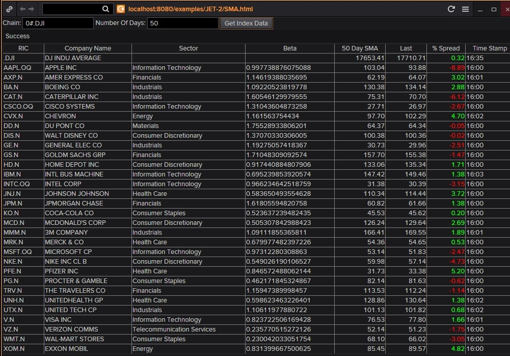

# % Spread Between Last and SMA on components of Chain

JET2 sample application calculates the percent spread betweeen the last trade price and the user supplied number of days simple moving average (SMA) using three different API's simultaneously to show how someone can rapidly develop and deploy a useful Eikon analytic that combines streaming, historical and fundemental data with simple to use and understand TR API's.  

In [SMA.html](SMA.html) a grid is used to display, for each component of the specified Chain, the following:

- RIC: Each RIC is provided by the streaming call to the Quotes object via the Chain argument
- Company Name:  Retrieved using FID DSPLY_NAME
- Sector: Retrieved from call to DSS using TR.GICSSECTOR
- Beta:  Retrieved from call to DSS using TR.WACCBeta
- N-Day SMA:  Calculated via call to TRTH from the returned daily time series
- Last:  Retrieved using FID CF_LAST for every streaming trade
- Time Stamp:  Retrieved using FID CF_TIME for every streaming trade

Below is a sample screeen shot of the application showing the DJI, using a 50-day SMA, from 5/17/2016:

# Setup Sandbox and Run

- Download and Install JET2 ZIP file
- Copy JET2 files to Tomcat and start local server
- Clear Eikon Cache upon any Javascript or HTML source code changes
- Run [SMA.html](SMA.html) from Eikon Menubar

# Documentation and Video

- See  file for more elaborate documentation of this sample application
- See Webex video (.ARF extension) for very short demo of this application
- See coming video for complete soup to nuts walk thru of the code (TBD:  will this be an .MP4 file?)
